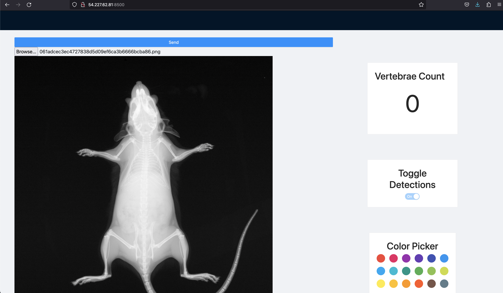
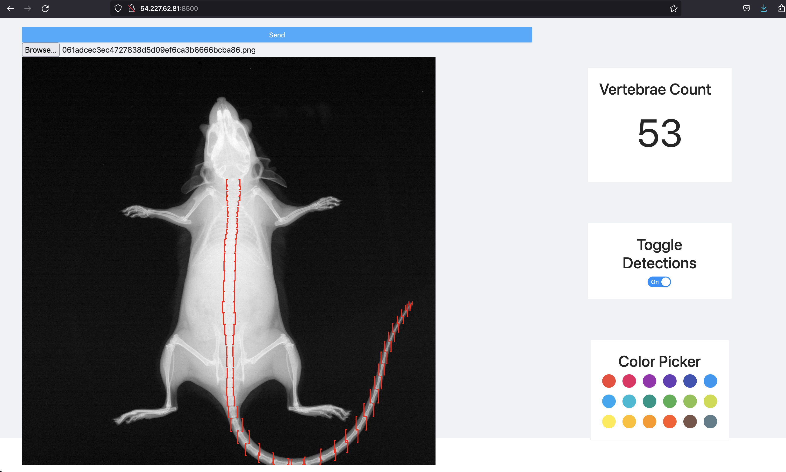

# vertebrae-counter
This project demonstrates the use of YOLOv3 algorithm (see [pjreddie's](https://pjreddie.com/darknet/yolo/) website) in creating an object detection model wrapped by a Django api for receiving x-ray images of knockout mice and detecting the vertebrae. The User Interface is implemented in React.

The image dataset of knockout mice used for training the YOLO model was obtained from the International Mouse Phenotyping Consortium (IMPC) [website](https://www.mousephenotype.org/data/search).

## Start up

To start up the application locally, clone the repo then then download the weights file [here](https://drive.google.com/file/d/1UmEtgd2U0DjQiP8lGoDEZ80Cb31Vzluj/view?usp=share_link). The weights file is the result of the trained model by applying the YOLOv3 algorithm on the mice x-ray images.

Move the downloaded weights file into the [mydarknet](./mydarknet/) folder within the repo folder then run the command below within the repository folder.

```bash
docker compose up --build
```

or

```bash
./start-local.sh
```

Navigate to `http://localhost:8500` to see the User Interface of the application.

## Test App
To test the application, you will need mice x-ray images. A few images can be found in the [images/samples](./images/samples/) folder.

Download an image and then select this image from the vertebrae counter interface and then hit the `Send` button.


The image wil be sent to the django backend which will pass the image through the trained yolo model and generated co-ordinates of bounding boxes for every vertebrae it detects. 




These values are then plotted on the image using the the React library known as `react-bounding-box`.
